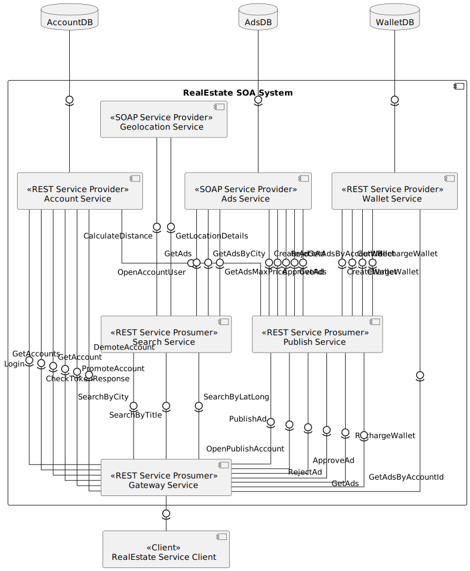
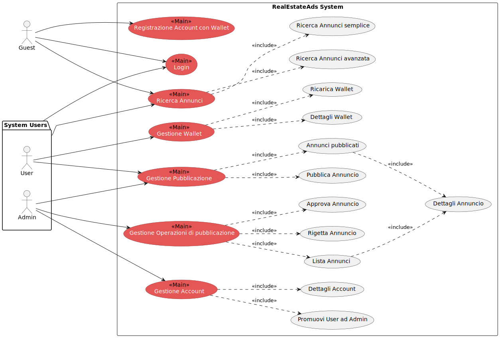
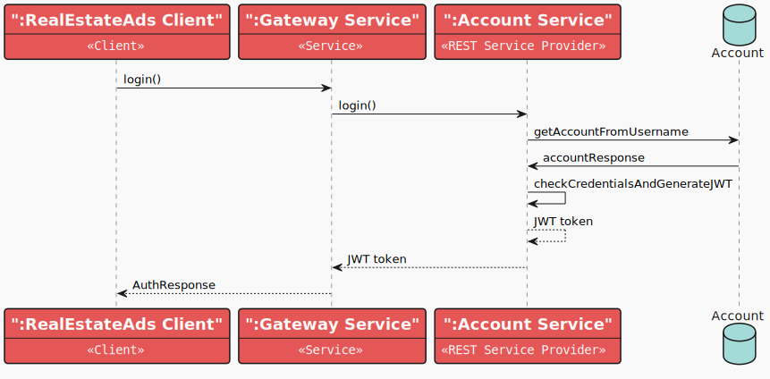
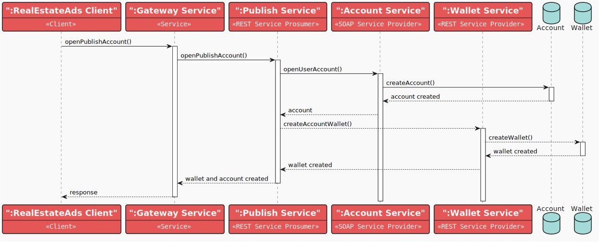
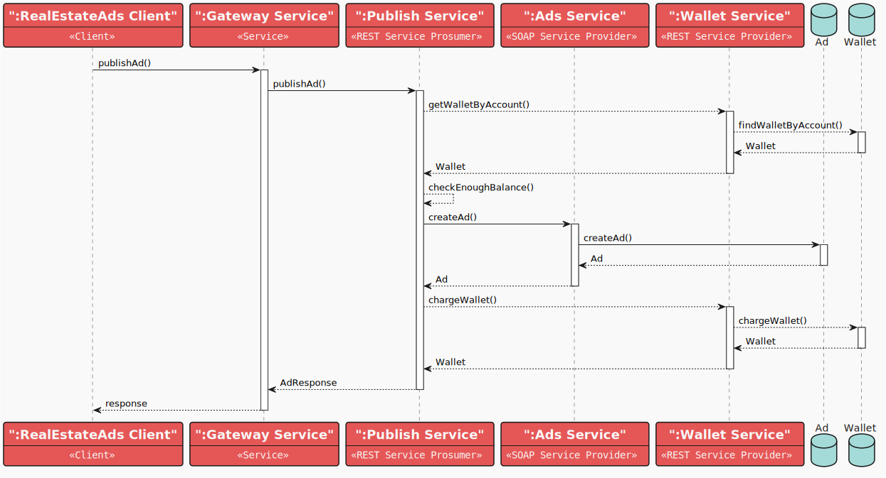

# RealEstateAds
The RealEstateAds system is a service-oriented architecture (SOA) system that provides a platform for users to publish and search for real estate ads. 
The system is composed of multiple services that handle different aspects of the system, such as account management, ad management, geolocation, and wallet management. 
The system is designed to be scalable, modular, and extensible, allowing for easy integration of new services and features.

It utilizes Apache CXF, Spring Boot, Docker, and Maven.

## System Objectives

- Provide a platform for users to publish real estate ads paying a fee.
- Allow users to create accounts and manage their ads.
- Provide a platform to search ads based on geolocation, title, and price.
- Allow users to manage their wallet and charge them for ad publication.
- Ensure system scalability, modularity, and extensibility.
- Provide a web frontend interface for users to interact with the system.
- Ensure system interoperability and integration through REST and SOAP services.
- Ensure system security and data privacy through JWT token-based authentication.

## Component Diagram

## Use Case Diagram

In this scenario, we can see all the system users who can perform the actions described earlier:

- **User**: Can create an account, login, publish an ad, search for ads, and manage their account.
- **Admin**: Can login, search for ads, manage all accounts, view ads and approve or reject them.
- **Guest**: Can search for ads and view them, register and login to the system in order to publish an ad.

### Components

1. **RealEstateAds SOA System**
    - Represents the main system that includes all subsystems and services.

2. **Account Service**
    - Type: REST Service Provider
    - Responsibilities: Manage account-related operations such as authentication, account creation, and management. It
      handles data persistence using a database to save account information.
    - Operations:
        - `OpenAccount (User/Admin)`
        - `Login`
        - `GetAccount`
        - `CheckTokenResponse`
        - `GetAccountById`
        - `GetAccounts`
        - `PromoteAccount`
        - `DemoteAccount`

3. **Ads Service**
    - Type: SOAP Service Provider
    - Responsibilities: Manage real estate ads-related operations such as ad creation, ad retrieval, and ad management.
      It handles data persistence using a database to save ad information.
    - Operations:
        - `CreateAd`
        - `GetAdDetails`
        - `GetAdsByTitle`
        - `GetAdsByTitlePaginated`
        - `GetAdsByAccountId`
        - `GetAdsMaxPrice`
        - `GetAdsByCity`
        - `GetAds`
        - `ApproveAd`
        - `RejectAd`

4. **Geolocation Service**
   - Type: SOAP Service Provider
   - Responsibilities: Manage geolocation-related operations such as distance from latitude and longitude, and city
     retrieval.
   - Operations:
      - `GetLocationDetails`
      - `CalculateDistance`

5. **Wallet Service**
   - Type: REST Service Provider
   - Responsibilities: Manage wallet-related operations such as wallet creation, wallet retrieval, and wallet management.
     It handles data persistence using a database to save wallet information.
   - Operations:
      - `createWallet`
      - `getWalletByWalletId`
      - `getWalletByAccountId`
      - `chargeWallet`
      - `reChargeWallet`

6. **Search Service Prosumer**
    - Type: REST Service Prosumer
    - Responsibilities: Manage search-related operations such as searching for ads by title, city and position.
    - Operations:
        - `searchByTitle`
        - `searchByCity`
        - `searchByLatLong`

7. **Publish Service Prosumer**
    - Type: REST Service Prosumer
    - Responsibilities: Manage ad publishing-related operations such as ad approval and rejection.
    - Operations:
        - `openPublishAccount`
        - `publishAd`
        - `approveAd`
        - `rejectAd`
        - `getAds`

8. **Gateway Service**
    - Type: Gateway
    - Responsibilities: Provide a unified entry point for the Ads system services.
    - Operations:
        - `HandleRequests`

9. **Discovery Service**
    - Type: Discovery
    - Responsibilities: Manage service discovery and integration within the system.

10. **Client**
    - Type: Angular SPA Client
    - Responsibilities: Web frontend interface interacting with the various services of the RealEstateAds system through the gateway to perform
      user-requested operations.

### Notes

- The **Client** communicates with the **Gateway Service** for all operations.
- The **Gateway Service** routes requests to the respective provider/prosumer services.
- Services follow SOA/Microservices paradigms with REST or SOAP interfaces, ensuring interoperability and scalability.
- Load balancing is defined according to a *"Non-Repetitive Random Iteration"* logic.
- Services are designed to be modular and can be updated or replaced independently without affecting the entire system.

(<a href="#readme-top">Back to table of contents</a>)

## Sequence Diagrams

### Login

During this operation, the registered user authenticates with the system. The user sends their credentials to the
system through the gateway, which forwards them to the account management service (Account Service). 
This service verifies the credentials and generates a JWT token. 
At the end of the process, a response containing the generated token is sent back.

### Signup

During this operation, the user creates a new account with associated wallet by registering in the RealEstateAds system.
The user sends the account details to the system through the gateway and the first request is made to 
the Publish Service (REST) to create the account then the second request is made to the Wallet Service (REST) to create the wallet.

This service will send two parallel requests:

1. One to the Account Service (REST) to create the account
2. One to the Wallet Service (REST) to create the wallet

### Search Ads

During this operation the user searches for ads on map that give a position (latitude, longitude), a radius and optionally a maxPrice
The user sends the search criteria to the system through the gateway, which forwards them to the search service prosumer (SearchA ds Service)
This service will send two sequential requests:

1. One to the Ads Service (SOAP) to get all ads
2. One to the Geolocation Service (SOAP) to get the distance between the user's position and the property position deschribed in the ad.
3. The SearchAds Service will then filter the ads that are in the radius and have a price lower than the maxPrice

### Publish Ad

During this operation, the user publishes a new ad on the system in Pending state. 
The ad is sent to the system through the gateway, which forwards it to the publish service prosumer (Publish Service).
This service will send three sequential requests:

1. One to the Wallet Service (REST) to check balance of the user that wants to publish the ad
2. One to the Ads Service (SOAP) to create the ad
3. One to the Wallet Service (REST) to charge the user for the ad publication

