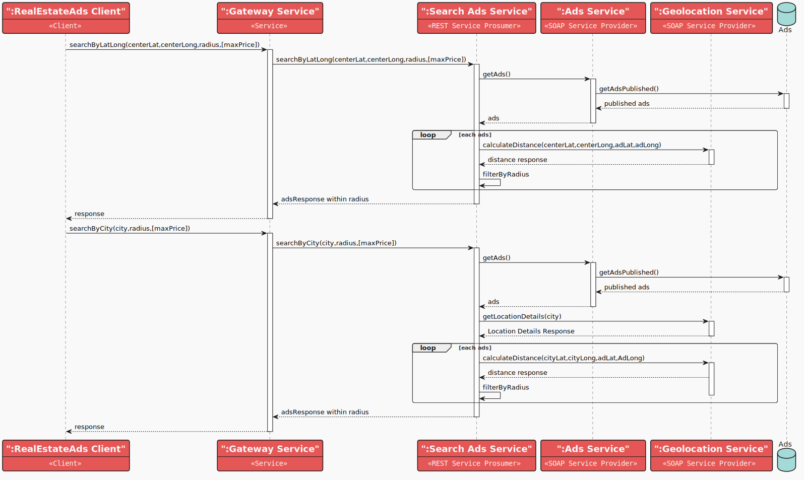

# RealEstateAds
The RealEstateAds system is a service-oriented architecture (SOA) system that provides a platform for users to publish and search for real estate ads. 
The system is composed of multiple services that handle different aspects of the system, such as account management, ad management, geolocation, and wallet management. 
The system is designed to be scalable, modular, and extensible, allowing for easy integration of new services and features.

It utilizes Apache CXF, Spring Boot, Docker, and Maven.

## System Objectives

- Provide a platform for users to publish real estate ads paying a fee.
- Allow users to create accounts and manage their ads.
- Provide a platform to search ads based on geolocation, title, and price.
- Allow users to manage their wallet and charge them for ad publication.
- Ensure system scalability, modularity, and extensibility.
- Provide a web frontend interface for users to interact with the system.
- Ensure system interoperability and integration through REST and SOAP services.
- Ensure system security and data privacy through JWT token-based authentication.

## Component Diagram


## Use Case Diagram


In this scenario, we can see all the system users who can perform the actions described earlier:

- **User**: Can create an account, login, publish an ad, search for ads, and manage their account.
- **Admin**: Can login, search for ads, manage all accounts, view ads and approve or reject them.
- **Guest**: Can search for ads and view them, register and login to the system in order to publish an ad.


### Components

1. **RealEstateAds SOA System**
    - Represents the main system that includes all subsystems and services.

2. **Account Service**
    - Type: REST Service Provider
    - Responsibilities: Manage account-related operations such as authentication, account creation, and management. It
      handles data persistence using a database to save account information.
    - Operations:
        - `OpenAccount (User/Admin)`
        - `Login`
        - `GetAccount`
        - `CheckTokenResponse`
        - `GetAccountById`
        - `GetAccounts`
        - `PromoteAccount`
        - `DemoteAccount`

3. **Ads Service**
    - Type: SOAP Service Provider
    - Responsibilities: Manage real estate ads-related operations such as ad creation, ad retrieval, and ad management.
      It handles data persistence using a database to save ad information.
    - Operations:
        - `CreateAd`
        - `GetAdDetails`
        - `GetAdsByTitle`
        - `GetAdsByTitlePaginated`
        - `GetAdsByAccountId`
        - `GetAdsMaxPrice`
        - `GetAdsByCity`
        - `GetAds`
        - `ApproveAd`
        - `RejectAd`

4. **Geolocation Service**
   - Type: SOAP Service Provider
   - Responsibilities: Manage geolocation-related operations such as distance from latitude and longitude, and city
     retrieval.
   - Operations:
      - `GetLocationDetails`
      - `CalculateDistance`

5. **Wallet Service**
   - Type: REST Service Provider
   - Responsibilities: Manage wallet-related operations such as wallet creation, wallet retrieval, and wallet management.
     It handles data persistence using a database to save wallet information.
   - Operations:
      - `createWallet`
      - `getWalletByWalletId`
      - `getWalletByAccountId`
      - `chargeWallet`
      - `reChargeWallet`

6. **Search Service Prosumer**
    - Type: REST Service Prosumer
    - Responsibilities: Manage search-related operations such as searching for ads by title, city and position.
    - Operations:
        - `searchByTitle`
        - `searchByCity`
        - `searchByLatLong`

7. **Publish Service Prosumer**
    - Type: REST Service Prosumer
    - Responsibilities: Manage ad publishing-related operations such as ad approval and rejection.
    - Operations:
        - `openPublishAccount`
        - `publishAd`
        - `approveAd`
        - `rejectAd`
        - `getAds`

8. **Gateway Service**
    - Type: Gateway
    - Responsibilities: Provide a unified entry point for the Ads system services.
    - Operations:
        - `HandleRequests`

9. **Discovery Service**
    - Type: Discovery
    - Responsibilities: Manage service discovery and integration within the system.

10. **Client**
    - Type: Angular SPA Client
    - Responsibilities: Web frontend interface interacting with the various services of the RealEstateAds system through the gateway to perform
      user-requested operations.

### Notes

- The **Client** communicates with the **Gateway Service** for all operations.
- The **Gateway Service** routes requests to the respective provider/prosumer services.
- Services follow SOA/Microservices paradigms with REST or SOAP interfaces, ensuring interoperability and scalability.
- Load balancing is defined according to a *"Non-Repetitive Random Iteration"* logic.
- Services are designed to be modular and can be updated or replaced independently without affecting the entire system.

<p align="right">(<a href="#readme-top">Back to table of contents</a>)</p>

## Sequence Diagrams

### Login


During this operation, the registered user authenticates with the system. The user sends their credentials to the
system through the gateway, which forwards them to the account management service (Account Service). 
This service verifies the credentials and generates a JWT token. 
At the end of the process, a response containing the generated token is sent back.

### Signup


During this operation, the user creates a new account with associated wallet by registering in the RealEstateAds system.
The user sends the account details to the system through the gateway and the first request is made to 
the Publish Service (REST) to create the account then the second request is made to the Wallet Service (REST) to create the wallet.

This service will send two parallel requests:

1. One to the Account Service (REST) to create the account
2. One to the Wallet Service (REST) to create the wallet

### Search Ads



During this operation the user searches for ads on map that give a position (latitude, longitude), a radius and optionally a maxPrice
The user sends the search criteria to the system through the gateway, which forwards them to the search service prosumer (SearchA ds Service)
This service will send two sequential requests:

1. One to the Ads Service (SOAP) to get all ads
2. One to the Geolocation Service (SOAP) to get the distance between the user's position and the property position deschribed in the ad.
3. The SearchAds Service will then filter the ads that are in the radius and have a price lower than the maxPrice


### Publish Ad


During this operation, the user publishes a new ad on the system in Pending state. 
The ad is sent to the system through the gateway, which forwards it to the publish service prosumer (Publish Service).
This service will send three sequential requests:

1. One to the Wallet Service (REST) to check balance of the user that wants to publish the ad
2. One to the Ads Service (SOAP) to create the ad
3. One to the Wallet Service (REST) to charge the user for the ad publication


# Implementation

For each project module, Spring Boot 3.3.1 and Apache CXF 4.0.4 were chosen.

In compliance with the exam requirements, no technologies other than those explained and adopted in class were used.

The project is divided into the following Maven modules:

1. **account-service**: Provider. Responsible for authentication and user management operations. This service was
   implemented in REST using Apache CXF (JAX-RS) and Spring Boot, registered with Netflix Eureka Server.

2. **ads-service**: Provider. Responsible for ads management. This service was implemented in SOAP
   using Apache CXF (JAX-WS) and Spring Boot, registered with Netflix Eureka Server.

3. **wallet-service**: Provider. Responsible for Wallet operations, creating recharge and charge. This service was implemented in REST using Apache
   CXF (JAX-RS) and Spring Boot, registered with Netflix Eureka Server.

4. **geolocation-service**: Provider. Responsible of giving distance between two couple of coords or a coord and or a city. This service was implemented in SOAP using Apache
      CXF (JAX-WS) and Spring Boot, registered with Netflix Eureka Server.

5. **search-service-prosumer**: Prosumer. Responsible for search ads operations. This service was implemented in REST
   using Apache CXF (JAX-RS) and Spring Boot, registered with Netflix Eureka Server. All operations are provided
   asynchronously. A REST client was developed, implementing load balancing towards the provider service.

6. **publish-service-prosumer**: Prosumer. Responsible for managing publishing operations, such as account opening ad and
   ad publishing.
   This service was implemented in REST using Apache CXF (JAX-RS) and Spring
   Boot, registered with Netflix Eureka Server. All operations are provided asynchronously. REST and SOAP clients were
   developed, implementing load balancing towards the provider service.

7. **gateway-service**: Gateway. Responsible for providing a unified entry point for our system's services. This service
   was implemented with Spring Cloud Reactive Gateway and uses Netflix Eureka Server.

8. **discovery-service**: Discovery. Responsible for managing service discovery and integration within the system. This
   service was implemented with Spring Cloud Discovery Eureka.

9. **client**: Client. It is implemented with Angular and PrimeNg Ui components framework. 
   It is an interfaces interacts with the Gateway to perform publish, search and login operations.
    operations. The built application is served from a Nginx server and any xhr connections starting with "/api" are 
   proxied to gateway service through Nginx directive.

The implementations of all Prosumer services are asynchronous, as they need to interact with one or more Provider
services, resulting in delays in their responses.

Regarding Providers, they have been optimized to support a high number of operations per second, allowing the
implementation of most of their operations synchronously.


## Integrating Spring Boot and Apache CXF

To integrate Apache CXF into a Spring Boot application, you need to add one of the following dependencies in
the `pom.xml`:

```xml

<dependencies>
    <!-- ...  -->
    <dependency>
        <groupId>org.apache.cxf</groupId>
        <artifactId>cxf-spring-boot-starter-jaxws</artifactId>
        <version>4.0.4</version>
    </dependency>

    <dependency>
        <groupId>org.apache.cxf</groupId>
        <artifactId>cxf-spring-boot-starter-jaxrs</artifactId>
        <version>4.0.4</version>
    </dependency>
    <!-- ...  -->
</dependencies>
```

- **cxf-spring-boot-starter-jaxws**: Configures and runs Apache CXF in a Spring application, integrating the necessary
  dependencies for running Apache CXF in SOAP mode (JAX-WS).

- **cxf-spring-boot-starter-jaxrs**: Configures and runs Apache CXF in a Spring application, integrating the necessary
  dependencies for running Apache CXF in REST mode (JAX-RS).

**Note**: If you want to implement a Spring Boot application that uses Apache CXF in both SOAP and REST modes, you only
need to include one of the dependencies, along with the client dependency for Apache CXF in the other mode. For example,
if you include only the `cxf-spring-boot-starter-jaxws` dependency (for SOAP), you just need to add the missing library
dependency `cxf-rt-rs-client` for the REST client in the `pom.xml`.

### Configuring Apache CXF for Proper Execution

To create a SOAP application, you need to manually configure Apache CXF. Here is the necessary Java code:

```java

@Configuration
public class CXFConfig {
    private final Bus bus;

    private final AdsService adsService;

    private final MetricsProvider metricsProvider;

    public CXFConfig(Bus bus, AdsService adsService, MetricsProvider metricsProvider) {
        this.bus = bus;
        this.adsService = adsService;
        this.metricsProvider = metricsProvider;
    }

    @Bean
    public LoggingFeature loggingFeature() {
        LoggingFeature loggingFeature = new LoggingFeature();
        loggingFeature.setPrettyLogging(true);
        return loggingFeature;
    }

    @Bean
    public Endpoint endpoint() {
        EndpointImpl endpoint = new EndpointImpl(this.bus, this.adsService, null, null, (WebServiceFeature[])new MetricsFeature[] { new MetricsFeature(this.metricsProvider) });
        endpoint.publish("/AdsService");
        return (Endpoint)endpoint;
    }
}
```

As seen abovee, you need to manually create a Java Bean that provides the proper initialization of an **Apache CXF
Endpoint**. Through dependency injection, Spring will inject: the `Bus` from Apache CXF, `AdsService` which is
the interface defining the SOAP services, and `MetricsProvider` which is the metrics provider (we will discuss this
further later).

To create a REST application, you can use Spring's component-scan to find all the classes needed by Apache CXF and
Spring to properly configure the service. The configuration of Apache CXF can be done using the following YAML commands:

```yaml
cxf:
  path: /services
  servlet.init:
    service-list-path: /info
  jaxrs:
    component-scan: true
    classes-scan-packages: it.disim.univaq.sose.account_service.config, it.disim.univaq.sose.account_service.service
```

As seen, under the `cxf.jaxrs` key, there are settings for the component-scan. You need to add to this key every package
that contains Apache CXF code (endpoints and various configurations). This way, Apache CXF will check the package for
configurations or endpoints.

In the YAML file, there are also the `cxf.path` and `cxf.servlet.init.service-list-path` keys, if set:

- **cxf.path**: Identifies the path of the servlet used by Apache CXF within the application.
- **cxf.servlet.init.service-list-path**: Identifies the path where Apache CXF will publish the list of managed
  services.


## Integration of Apache CXF Service Description OpenApi in Spring Boot

To integrate Apache CXF's Service Description OpenApi into Spring Boot, add the following dependencies to
your `pom.xml`:

```xml

<dependencies>
    <!-- ... -->
    <dependency>
        <groupId>org.webjars</groupId>
        <artifactId>swagger-ui</artifactId>
        <version>5.17.14</version>
    </dependency>
    <dependency>
        <groupId>org.apache.cxf</groupId>
        <artifactId>cxf-rt-rs-service-description</artifactId>
        <version>4.0.4</version>
    </dependency>
    <dependency>
        <groupId>org.apache.cxf</groupId>
        <artifactId>cxf-rt-rs-service-description-openapi-v3</artifactId>
        <version>4.0.4</version>
    </dependency>
    <!-- ... -->
</dependencies>
```

After adding the dependencies, create a Java Bean to provide a properly configured instance of `OpenApiFeature`:

```java

@Configuration
public class ApacheCXFConfig {
    @Value("${cxf.path}")
    private String cxfPath;

    @Bean
    public OpenApiFeature createOpenApiFeature() {
      OpenApiFeature openApiFeature = new OpenApiFeature();
      openApiFeature.setPrettyPrint(true);
      openApiFeature.setTitle("Account Service System");
      openApiFeature.setContactName("System team");
      openApiFeature.setDescription("This is Account Service. Uses Apache CXF and Spring Boot on JAX-RS.");
      openApiFeature.setVersion("0.0.1-SNAPSHOT");
      openApiFeature.setSwaggerUiConfig((new SwaggerUiConfig())

              .url(this.cxfPath + "/openapi.json").queryConfigEnabled(false));
      return openApiFeature;
    }

    // ...
}
```


# WebAppClient for the RealEstateAds System
For this system, we decided to implement a SPA client using the framework Angular, PrimeNg ui components library, RxJs 
for the rest API interactions and Leaflet as map component viewer .


The implemented operations are:

login: Access to the system (interacts with Account-Service)
logout: Logout from the system (interacts with Account-Service)
signup: Opening an account (interacts with publish-service)
search Ads: Search ads operations (interacts with search-service)
publish ad: Publish an ad (interacts with publish-service)
approve ad: Approve an ad (interacts with publish-service)
reject ad: Reject an ad (interacts with publish-service)
get ads: Get all ads (interacts with publish-service)
get ad details: Get ad details (interacts with publish-service)
get ad status: Get ad status (interacts with publish-service)
get account: Get account details (interacts with account-service)
get accounts: Get all accounts (interacts with account-service)
promote account: Promote an account (interacts with account-service)
demote account: Demote an account (interacts with account-service)

these operations are implemented in the Angular services, here an example of the **publish-service**:

```typescript
import { Injectable } from '@angular/core';
import { HttpClient, HttpHeaders } from '@angular/common/http';
import { interval, Observable, switchMap, takeWhile, tap } from 'rxjs';


export interface GetAdsRequest {
  page: number;
  size: number;
  sortBy?: string;
  sortOrder?: string;
  status?: 'PENDING_APPROVAL' | 'APPROVED' | 'REJECTED' | 'PUBLISHED';
}

export function getPossibleStatuses(): GetAdsRequest['status'][] {
  return ['PENDING_APPROVAL', 'APPROVED', 'REJECTED', 'PUBLISHED'];
}

export interface AdPaginatedResponse {
  content: AdResponse[];
  currentPage: number;
  totalPages: number;
  totalItems: number;
}

export interface AdResponse {
  id: number;
  title: string;
  description: string;
  squareMeters: number;
  price: number;
  location: string;
  latitude: number;
  longitude: number;
  status: string;
  accountId: number;
}

export interface AdStatusResponse {
  status: string;
}

export interface PublishGetAdsResponse {
  adsResponse: AdResponse[];
}

export interface PublishAdRejectRequest {
  reason: string;
}

export interface OpenPublishAccountRequest {
  username: string;
  password: string;
  email: string;
  name: string;
  surname: string;
  mobile: string;
}

export interface OpenPublishAccountResponse {
  id: number;
  username: string;
  walletId: string; // UUID as string
}

export interface PublishAdRequest {
  accountId: number | null;
  latitude: number | null;
  location: string |null;
  longitude: number | null;
  price: number | null;
  squareMeters: number | null;
  title: string | null;
  description?: string |null;
}

export interface PublishAdResponse {
  adId: number; // int64
  title: string;
}


@Injectable({
  providedIn: 'root'
})
export class PublishService {
  private baseUrl = '/api/publish';

  constructor(private http: HttpClient) {}

  /**
   * Approve an ad.
   * @param adId - ID of the ad to approve.
   */
  approveAd(adId: number): Observable<any> {
    const url = `${this.baseUrl}/ad/${adId}/approve`;
    const headers = new HttpHeaders({ 
      'Content-Type': 'application/json',
      'Use-Auth': 'true' // tells interceptor to include bearer token
    });
    return this.http.put<any>(url, null, { headers });
  }

  /**
   * Publish a new ad.
   * @param publishAdRequest - Object containing ad details.
   */
  publishAd(publishAdRequest: PublishAdRequest): Observable<PublishAdResponse> {
    const url = `${this.baseUrl}/ad`;
    const headers = new HttpHeaders({ 
      'Content-Type': 'application/json',
      'Use-Auth': 'true' // tells interceptor to include bearer token
    });
    return this.http.post<PublishAdResponse>(url, publishAdRequest, { headers });
  }

  /**
   * Get the status of an ad.
   * @param adId 
   * @returns 
   */
  getAdStatus(adId: number): Observable<AdStatusResponse> {
    const headers = new HttpHeaders({ 
      'Content-Type': 'application/json',
      'Use-Auth': 'true' // tells interceptor to include bearer token
    });
    return this.http.get<AdStatusResponse>(`${this.baseUrl}/ad/${adId}/status`, { headers });
  }

  /**
   * Poll the status of an ad.
   * @param adId - ID of the ad to poll.
   * @param pollInterval - Interval in milliseconds between polls.
   * @returns Observable that emits the status of the ad.
   *         Completes when the status is no longer 'PENDING_APPROVAL'.
   *        Errors if the ad does not exist.
   *       Unsubscribing stops the polling.
   *     The first value emitted is the current status of the ad.
   */
  pollStatus(adId: number, pollInterval : number = 2000): Observable<AdStatusResponse> {
    return interval(pollInterval).pipe( // Polling ogni 2 secondi
      switchMap(() => this.getAdStatus(adId)),
      takeWhile(response => response.status === 'PENDING_APPROVAL', true), // Ferma il polling quando lo stato cambia
      tap(response => console.log('Stato attuale:', response.status))
    );
  }


  /**
   * Reject an ad.
   * @param adId - ID of the ad to reject.
   * @param rejectionReason - Reason for rejection.
   */
  rejectAd(adId: number, rejectionReason: PublishAdRejectRequest ): Observable<any> {
    const url = `${this.baseUrl}/ad/${adId}/reject`;
    const headers = new HttpHeaders({ 
      'Content-Type': 'application/json',
      'Use-Auth': 'true' // tells interceptor to include bearer token
    });
    return this.http.put<any>(url, rejectionReason, { headers });
  }

  getAds(request: GetAdsRequest): Observable<AdPaginatedResponse> {
    const headers = new HttpHeaders({ 
      'Content-Type': 'application/json',
      'Use-Auth': 'true' // tells interceptor to include bearer token
    });
    return this.http.post<AdPaginatedResponse>(
      `${this.baseUrl}/ads`,
      request,
      { headers }
    );
  }

  getAdsAccount(accountId: number): Observable<PublishGetAdsResponse> {
    const headers = new HttpHeaders({ 
      'Content-Type': 'application/json',
      'Use-Auth': 'true' // tells interceptor to include bearer token
    });
    return this.http.get<PublishGetAdsResponse>(
      `${this.baseUrl}/ads/account/${accountId}`,
      { headers }
    );
  }

  /**
   * Open a new publish account.
   * @param openPublishAccountRequest - Object containing account details.
   */
  openPublishAccount(openPublishAccountRequest: OpenPublishAccountRequest): Observable<OpenPublishAccountResponse> {
    const url = `${this.baseUrl}/account`;
    const headers = new HttpHeaders({
      'Content-Type': 'application/json',
      'Use-Auth': 'true' // tells interceptor to include bearer token
    });
    return this.http.post<OpenPublishAccountResponse>(url, openPublishAccountRequest, { headers });
  }
}

```

The client interacts with the gateway service to perform the operations, the gateway service is responsible for routing


## Dockerfile Implementation

To distribute our project, we have chosen a distribution based on Docker containers. To generate executable Docker
images, it is essential to create an appropriate Dockerfile for each module to be containerized.

Here is an example of a Dockerfile for services that do not use a code generation plugin:

```dockerfile
# Step 1: Build
FROM maven:3.9.7-amazoncorretto-17 AS build

# Set the working directory
WORKDIR /app

# Copy file pom.xml and download dependencies
COPY publish-service/pom.xml .
RUN mvn dependency:go-offline -B

# Copy the WSDL files into the build directory
COPY wsdl /app/../wsdl

# Copy the Openapi files into the build directory
COPY openapi /app/../openapi

# Copy the code and compile the project
COPY publish-service/src /app/src

# Run code generation and Maven build command, skipping tests
RUN mvn clean generate-sources package -DskipTests

# Step 2: Run
FROM amazoncorretto:17.0.12-alpine3.19

# Set the working directory
WORKDIR /app

COPY  --from=build /wsdl /wsdl

# Copy the jar from the build stage
COPY --from=build /app/target/*.jar app.jar

# Expose ports
EXPOSE 7150

LABEL name="RealEstate Ads - Publish Service" \
      description="Publish Service for RealEstate Ads" \
      version="0.0.1"

# Command to run the application
ENTRYPOINT ["sh", "-c", "java $JAVA_OPTS -Djava.security.egd=file:/dev/./urandom -jar /app/app.jar"]
```

and the docker compose file to run the system with all the services and them dependencies:

```yaml
services:
  rea-mysql:
    image: mysql:latest
    environment:
      MYSQL_ROOT_PASSWORD: password
    restart: always
    volumes:
      - rea-mysql-data:/var/lib/mysql
    ports:
      - "3306:3306"
    networks:
      - rea-network
    healthcheck:
      test: [ "CMD", "mysqladmin", "ping", "-h", "localhost" ]
      interval: 10s
      retries: 5
      start_period: 10s
      timeout: 5s

  rea-phpmyadmin:
    image: phpmyadmin:latest
    ports:
      - "7071:80"
    environment:
      PMA_HOST: rea-mysql
      PMA_PORT: 3306
    networks:
      - rea-network
    depends_on:
      rea-mysql:
        condition: service_healthy

  rea-discovery-service:
    build: ./discovery-service
    image: rea-discovery-service
    ports:
      - "7002:7002"
    environment:
      SERVICE_HOSTNAME: "host.docker.internal"
      SERVICE_PORT: "7002"
    depends_on:
      rea-mysql:
        condition: service_healthy
    networks:
      - rea-network
    tty: true
    healthcheck:
      test: [ "CMD", "curl", "-f", "http://localhost:7002/actuator/health" ]
      interval: 30s
      timeout: 10s
      retries: 3

  rea-gateway:
    image: rea-gateway
    build: ./gateway
    ports:
      - "7100:7100"
    environment:
      EUREKA_SERVER_HOSTNAME: "host.docker.internal"
      EUREKA_SERVER_PORT: "7002"
    healthcheck:
      test: [ "CMD", "curl", "-f", "http://localhost:7100/actuator/health" ]
      interval: 30s
      timeout: 10s
      retries: 5
      start_period: 10s
    networks:
      - rea-network
    depends_on:
      rea-discovery-service:
        condition: service_started

  rea-account-service:
    build: ./account-service
    image: rea-account-service
    ports:
      - "7110:7110"
    environment:
      EUREKA_SERVER_HOSTNAME: "host.docker.internal"
      EUREKA_SERVER_PORT: "7002"
      MYSQL_HOST: "host.docker.internal"
    healthcheck:
      test: [ "CMD", "curl", "-f", "http://localhost:7110/actuator/health" ]
      interval: 30s
      timeout: 10s
      retries: 5
      start_period: 10s
    depends_on:
      rea-mysql:
        condition: service_healthy
      rea-discovery-service:
        condition: service_healthy
    networks:
      - rea-network
    tty: true

  rea-wallet-service:
    build: ./wallet-service
    image: rea-wallet-service
    ports:
      - "7160:7160"
    environment:
      EUREKA_SERVER_HOSTNAME: "host.docker.internal"
      EUREKA_SERVER_PORT: "7002"
      MYSQL_HOST: "host.docker.internal"
    healthcheck:
      test: [ "CMD", "curl", "-f", "http://localhost:7160/actuator/health" ]
      interval: 30s
      timeout: 10s
      retries: 5
      start_period: 10s
    depends_on:
      rea-mysql:
        condition: service_healthy
      rea-discovery-service:
        condition: service_healthy
    networks:
      - rea-network
    tty: true

  rea-ads-service:
    build: ./ads-service
    image: rea-ads-service
    ports:
      - "7130:7130"
    environment:
      EUREKA_SERVER_HOSTNAME: "host.docker.internal"
      EUREKA_SERVER_PORT: "7002"
      MYSQL_HOST: "host.docker.internal"
    healthcheck:
      test: [ "CMD", "curl", "-f", "http://localhost:7130/actuator/health" ]
      interval: 30s
      timeout: 10s
      retries: 5
      start_period: 10s
    depends_on:
      rea-mysql:
        condition: service_healthy
      rea-discovery-service:
        condition: service_healthy
    networks:
      - rea-network
    tty: true

  rea-geolocation-service:
    build: ./geolocation-service
    image: rea-geolocation-service
    ports:
      - "7120:7120"
    environment:
      EUREKA_SERVER_HOSTNAME: "host.docker.internal"
      EUREKA_SERVER_PORT: "7002"
    healthcheck:
      test: [ "CMD", "curl", "-f", "http://localhost:7120/actuator/health" ]
      interval: 30s
      timeout: 10s
      retries: 5
      start_period: 10s
    depends_on:
      rea-discovery-service:
        condition: service_healthy
    networks:
      - rea-network
    tty: true

  rea-search-service:
    build:
      context: .
      dockerfile: search-service/Dockerfile
    image: rea-search-service
    deploy:
      replicas: 3
    ports:
      - "7140-7142:7140"
    environment:
      EUREKA_SERVER_HOSTNAME: "host.docker.internal"
      EUREKA_SERVER_PORT: "7002"
    healthcheck:
      test: [ "CMD", "curl", "-f", "http://localhost:7140/actuator/health" ]
      interval: 30s
      timeout: 10s
      retries: 5
      start_period: 10s
    depends_on:
      rea-discovery-service:
        condition: service_healthy
      rea-ads-service:
        condition: service_healthy
      rea-geolocation-service:
        condition: service_healthy
    networks:
      - rea-network
    tty: true

  rea-publish-service:
    build:
      context: .
      dockerfile: publish-service/Dockerfile
    image: rea-publish-service
    ports:
      - "7150:7150"
    environment:
      EUREKA_SERVER_HOSTNAME: "host.docker.internal"
      EUREKA_SERVER_PORT: "7002"
    depends_on:
      rea-discovery-service:
        condition: service_healthy
      rea-account-service:
        condition: service_healthy
      rea-ads-service:
        condition: service_healthy
      rea-wallet-service:
        condition: service_healthy
    networks:
      - rea-network
    tty: true

  rea-client:
    build:
      context: .
      dockerfile: client/Dockerfile
    image: rea-client
    ports:
      - "80:80"
    networks:
      - rea-network
    depends_on:
      rea-gateway:
        condition: service_healthy
      rea-search-service:
        condition: service_healthy
      rea-publish-service:
        condition: service_healthy

volumes:
  rea-mysql-data:

networks:
  rea-network:
    driver: bridge
```

## Scalability and Service Replication for Load Management
Due to the nature of the system, it is essential to ensure that it can handle a high number of requests and workloads
without overloading the services.
During the high-load period the service could be affected by a huge number of requests, so it is necessary to replicate,
is Search-Service

For this reason, we have included the necessary configurations for replicating service in the `docker-compose`
file, as shown in the following example:

````yaml
  rea-search-service:
    build:
      context: .
      dockerfile: search-service/Dockerfile
    image: rea-search-service
    deploy:
      replicas: 3
    ports:
      - "7140-7142:7140"
    environment:
      EUREKA_SERVER_HOSTNAME: "host.docker.internal"
      EUREKA_SERVER_PORT: "7002"
    healthcheck:
      test: [ "CMD", "curl", "-f", "http://localhost:7140/actuator/health" ]
      interval: 30s
      timeout: 10s
      retries: 5
      start_period: 10s
    depends_on:
      rea-discovery-service:
        condition: service_healthy
      rea-ads-service:
        condition: service_healthy
      rea-geolocation-service:
        condition: service_healthy
    networks:
      - rea-network
    tty: true
````

Specifically:

````yaml
deploy:
  replicas: 3
````

specifies how many replicas should be deployed, and

````yaml
ports:
  - "7140-7142:7140"
````

specifies the range of ports to assign.

This allows defining the number of replicas for each service based on needs and load demands.

Thanks to this configuration, the system can withstand even higher workloads if necessary.

The client services used by prosumers obtain the available provider instances through Eureka.
By following the **"random without repetition"** load balancing policy we developed, it ensures an even distribution of
requests among the different replicas, avoiding overloads on single instances and thereby improving the overall system
performance.


## Configuration Guide

A detailed guide outlining all the steps necessary to configure and start the application.

### Prerequisites

- Ensure Docker is installed.

### Cloning the Repository

Clone the public git repository:

```sh
git clone https://github.com/fpaolant/RealEstateAds.git
```

_Or via SSH:_

```sh
git clone git@github.com:fpaolant/RealEstateAds.git
```

### Starting Services with Docker

After executing the previous command, still in the project's main directory, run the Docker Compose command to build and
start all services:

```sh
docker compose up --build
```

### Open the browser
When all services are up and running, open the browser and go to the following address:

```sh
http://localhost
```

Enjoy the RealEstateAds system!

## Demo video

<a href="https://univaq-my.sharepoint.com/:v:/g/personal/fabio_paolantonio_univaq_it/Eag65awOIFNCnvoTJ6zIS0MBOG13o5bnNA_qV2QfiX6dQg?nav=eyJyZWZlcnJhbEluZm8iOnsicmVmZXJyYWxBcHAiOiJPbmVEcml2ZUZvckJ1c2luZXNzIiwicmVmZXJyYWxBcHBQbGF0Zm9ybSI6IldlYiIsInJlZmVycmFsTW9kZSI6InZpZXciLCJyZWZlcnJhbFZpZXciOiJNeUZpbGVzTGlua0NvcHkifX0&e=5JPaYR">
<strong>Demo video»</strong></a>


